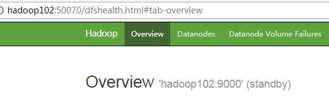
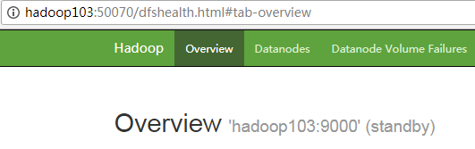
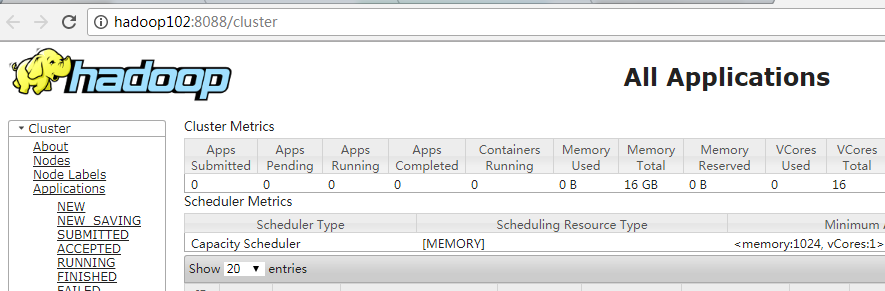

### hadoop 安装
* `tar -zxvf` hadoop包
* 配置环境变量
```
JAVA_HOME=/opt/module/jdk1.8.0_121
HADOOP_HOME=/opt/module/hadoop-3.1.3
PATH=$PATH:$JAVA_HOME/bin:$HADOOP_HOME/bin:$HADOOP_HOME/sbin
export JAVA_HOME HADOOP_HOME PATH
```
* `/etc/core-site.xml` hdfs的分布式系统使用配置（默认是本地模式） 依赖 namenode datanode的进程  
```xml
<property>
  <name>fs.defaultFS</name>
  <value>hdfs://governance1:9000</value>
</property>
```

* hadoop 的数据存放文件路径
```xml
    <property>
      <name>hadoop.tmp.dir</name>
      <!--<value>/tmp/hadoop-${user.name}</value> -->
      <value>/opt/module/hadoop-3.1.3/data/tmp</value>
    </property>
```  

* `hadoop namenode -format`格式化生成路径  

* `hadoop-daemon.sh start namenode` web 访问 `ip:50070` 或者jps命令 可以验证namenode是否启动成功

* yarn配置 `yarn-site.xml`
```xml
<property>
    <name>yarn.resourcemanager.hostname</name>
    <value>0.0.0.0</value>
  </property> 
```
* 2.x版本设置mapreduce shuffle的配置 3.x版本待研究
```xml
<property>
    <description>A comma separated list of services where service name should only
      contain a-zA-Z0-9_ and can not start with numbers</description>
    <name>yarn.nodemanager.aux-services</name>
    <value></value>
    <!--<value>mapreduce_shuffle</value>-->
  </property>
```


* mapreduce 程序在yarn上运行需要配置 `mapred-site.xml`
```xml
<property>
  <name>mapreduce.framework.name</name>
  <value>yarn</value>
</property>
```
* `yarn-daemon.sh start resourcemanager` 启动RM
* `yarn-daemon.sh start nodemanager` 启动NM  

### 分布式环境安装注意点
* 规划
    1. HDFS 1个NN + N个 DN + N个2NN
    2. YARN 1个RM + N个NM
    3. 
       |hadoop1|hadoop2|hadoop3
       |---- | ----| ----|
       |DN   | DN  |  DN |
       |NM   | NM  |  NM |
       |NN   | RM  |  2NM|
* 配置`core-site.xml` 同单机版
* `hdfs-site.xml` 配置2NN
```xml
<property>
  <name>dfs.namenode.secondary.https-address</name>
  <value>0.0.0.0:9869</value>
  <description>
    The secondary namenode HTTPS server address and port.
  </description>
</property>
```
* `yarn-site.xml`配置RM
```xml
<property>
    <description>The hostname of the RM.</description>
    <name>yarn.resourcemanager.hostname</name>
    <value>0.0.0.0</value>
  </property> 
```
* 启动hadoop
    1. 先格式化namenode
    2. `hadoop-daemon.sh start namenode && datanode`
    3. `hadoop-daemon.sh start secondarynamenode`
    4. `yarn-daemon.sh start resourcemanager && yarn-daemon.sh start nodemanager`
    5. `/sbin/start-all.sh`群起脚本注意事项：是读取 `HADOOP_HOME/etc/hadoop/slaves(wokers)` 获取集群中所有节点主机名
       注意需要配置SSH 免密登录 和 当前用户家目录 `.bashrc` 配置了 `source /etc/profile`
* 配置历史服务器 `mapred-site.xml`
```xml
<property>
  <name>mapreduce.jobhistory.address</name>
  <value>0.0.0.0:10020</value>
  <description>MapReduce JobHistory Server IPC host:port</description>
</property>

<property>
  <name>mapreduce.jobhistory.webapp.address</name>
  <value>0.0.0.0:19888</value>
  <description>MapReduce JobHistory Server Web UI host:port</description>
</property>
```
`yarn-site.xml`
```xml
<property>
    <description>
    URL for log aggregation server
    </description>
    <name>yarn.log.server.url</name>
    <value>http://hadoop1:19888/jobhistory/logs</value>
  </property>
```
```xml
<property>
    <name>yarn.log-aggregation-enable</name>
    <value>true</value>
  </property>
```
```xml
<property>
    <description>How long to keep aggregation logs before deleting them.  -1 disables. 
    Be careful set this too small and you will spam the name node.</description>
    <name>yarn.log-aggregation.retain-seconds</name>
    <value>-1</value>
  </property> 
```
* hadoop HA（保证NM 和 RM 故障时 采取容错机制）  
    1. 元数据的同步  
       在active的NN格式化后，将空白的fsimage文件拷贝到所有NN的机器上  
       active的NN启动后，将edits文件中的内容发给journalNode进程，standby状态的NN主动从journalNode进程中同步元数据  
    2. journalNode适合启动奇数台，至少三个  
    3. 如果开启了hdfs的HA，不能再启动2NN
* HDFS HA搭建
    1.  fs.defaultFS= 进行修改，配置N个NN运行的主机和开发的端口
    2. 配置journalNode
    3. 先启动journalNode
    4. 启动所有的NN，将其中一个转active状态
    5. 配置 `core-site.xml`文件
    ```xml
		<property>
			<name>fs.defaultFS</name>
        	<value>hdfs://mycluster</value>
		</property>
    ```
    6. 配置 `hdfs-site.xml`文件
    ```xml
    <!-- 完全分布式集群名称 -->
    	<property>
    		<name>dfs.nameservices</name>
    		<value>mycluster</value>
    	</property>
    
    	<!-- 集群中NameNode节点都有哪些 -->
    	<property>
    		<name>dfs.ha.namenodes.mycluster</name>
    		<value>nn1,nn2</value>
    	</property>
    
    	<!-- nn1的RPC通信地址 -->
    	<property>
    		<name>dfs.namenode.rpc-address.mycluster.nn1</name>
    		<value>hadoop102:9000</value>
    	</property>
    
    	<!-- nn2的RPC通信地址 -->
    	<property>
    		<name>dfs.namenode.rpc-address.mycluster.nn2</name>
    		<value>hadoop103:9000</value>
    	</property>
    
    	<!-- nn1的http通信地址 -->
    	<property>
    		<name>dfs.namenode.http-address.mycluster.nn1</name>
    		<value>hadoop102:50070</value>
    	</property>
    
    	<!-- nn2的http通信地址 -->
    	<property>
    		<name>dfs.namenode.http-address.mycluster.nn2</name>
    		<value>hadoop103:50070</value>
    	</property>
    
    	<!-- 指定NameNode元数据在JournalNode上的存放位置 -->
    	<property>
    		<name>dfs.namenode.shared.edits.dir</name>
    	<value>qjournal://hadoop102:8485;hadoop103:8485;hadoop104:8485/mycluster</value>
    	</property>
    
    	<!-- 配置隔离机制，即同一时刻只能有一台服务器对外响应 -->
    	<property>
    		<name>dfs.ha.fencing.methods</name>
    		<value>sshfence</value>
    	</property>
    
    	<!-- 使用隔离机制时需要ssh无秘钥登录-->
    	<property>
    		<name>dfs.ha.fencing.ssh.private-key-files</name>
    		<value>/home/atguigu/.ssh/id_rsa</value>
    	</property>
    
    	<!-- 声明journalnode服务器存储目录-->
    	<property>
    		<name>dfs.journalnode.edits.dir</name>
    		<value>/opt/ha/hadoop-2.7.2/data/jn</value>
    	</property>
    
    	<!-- 关闭权限检查-->
    	<property>
    		<name>dfs.permissions.enable</name>
    		<value>false</value>
    	</property>
    
    	<!-- 访问代理类：client，mycluster，active配置失败自动切换实现方式-->
    	<property>
      		<name>dfs.client.failover.proxy.provider.mycluster</name>
    	<value>org.apache.hadoop.hdfs.server.namenode.ha.ConfiguredFailoverProxyProvider</value>
    	</property>
    ```
    7. 在各个JournalNode节点上，输入以下命令启动journalnode服务 `sbin/hadoop-daemon.sh start journalnode`
    8. 在[nn1]上，对其进行格式化，并启动  
    `bin/hdfs namenode -format`  
    `sbin/hadoop-daemon.sh start namenode`
    9. 在[nn2]上，同步nn1的元数据信息  
    `bin/hdfs namenode -bootstrapStandby`
    10. 启动[nn2]
    `sbin/hadoop-daemon.sh start namenode`
    11. 查看web页面显示，如图3-21，3-22所示  
      
      
    12. 在[nn1]上，启动所有datanode  
    `sbin/hadoop-daemons.sh start datanode`
    13. 将[nn1]切换为Active  
    `bin/hdfs haadmin -transitionToActive nn1`
    14.	查看是否Active  
    `bin/hdfs haadmin -getServiceState nn1`
    15. 配置HDFS-HA自动故障转移  
    hdfs-site.xml
    ```xml
    <property>
    	<name>dfs.ha.automatic-failover.enabled</name>
    	<value>true</value>
    </property>
    ```
    core-site.xml
    ```xml
    <property>
    	<name>ha.zookeeper.quorum</name>
    	<value>hadoop102:2181,hadoop103:2181,hadoop104:2181</value>
    </property>
    ```
    16. 启动
        1. 关闭所有HDFS服务  
        `sbin/stop-dfs.sh`  
        2. 启动Zookeeper集群  
        `bin/zkServer.sh start`
        3. 初始化HA在Zookeeper中状态  
        `bin/hdfs zkfc -formatZK`
        4. 启动HDFS服务  
        `sbin/start-dfs.sh`
        5. 在各个NameNode节点上启动DFSZK Failover Controller，先在哪台机器启动，哪个机器的NameNode就是Active NameNode  
        `sbin/hadoop-daemin.sh start zkfc`
        6. 验证  
            1. 将Active NameNode进程kill  
            `将Active NameNode进程kill`
            2. 将Active NameNode机器断开网络  
            `service network stop`
* yarn-HA配置
    1. 规划集群  
    
    | hadoop102 | hadoop103 | hadoop104 |
    | ----      | ----      | ----      |
    | NameNode  | NameNode  |           |
    | JournalNode | JournalNode | JournalNode |
    | DataNode  | DataNode  | DataNode |
    | ZK        | ZK        | ZK       |
    | ResourceManager| ResourceManager|   |
    | NodeManager  | NodeManager  |           |
    2. yarn-site.xml 配置 
    
    ```xml
    <configuration>
    <property>
        <name>yarn.nodemanager.aux-services</name>
        <value>mapreduce_shuffle</value>
    </property>

    <!--启用resourcemanager ha-->
    <property>
        <name>yarn.resourcemanager.ha.enabled</name>
        <value>true</value>
    </property>
 
    <!--声明两台resourcemanager的地址-->
    <property>
        <name>yarn.resourcemanager.cluster-id</name>
        <value>cluster-yarn1</value>
    </property>

    <property>
        <name>yarn.resourcemanager.ha.rm-ids</name>
        <value>rm1,rm2</value>
    </property>

    <property>
        <name>yarn.resourcemanager.hostname.rm1</name>
        <value>hadoop102</value>
    </property>

    <property>
        <name>yarn.resourcemanager.hostname.rm2</name>
        <value>hadoop103</value>
    </property>
 
    <!--指定zookeeper集群的地址--> 
    <property>
        <name>yarn.resourcemanager.zk-address</name>
        <value>hadoop102:2181,hadoop103:2181,hadoop104:2181</value>
    </property>

    <!--启用自动恢复--> 
    <property>
        <name>yarn.resourcemanager.recovery.enabled</name>
        <value>true</value>
    </property>
 
    <!--指定resourcemanager的状态信息存储在zookeeper集群--> 
    <property>
        <name>yarn.resourcemanager.store.class</name>     <value>org.apache.hadoop.yarn.server.resourcemanager.recovery.ZKRMStateStore</value>
    </property>
    </configuration>
    ```  

    3. 启动hdfs(启动过可忽略此步骤)
        1. 在各个JournalNode节点上，输入以下命令启动journalnode服务  
        `sbin/hadoop-daemon.sh start journalnode`
        2. 在[nn1]上，对其进行格式化，并启动  
            `bin/hdfs namenode -format`  
            `sbin/hadoop-daemon.sh start namenode`
        3. 在[nn2]上，同步nn1的元数据信息  
            `bin/hdfs namenode -bootstrapStandby`
        4. 启动[nn2]
            `sbin/hadoop-daemon.sh start namenode`
        5. 查看web页面显示，如图所示  
              
              
        6. 在[nn1]上，启动所有datanode  
            `sbin/hadoop-daemons.sh start datanode`
        7. 将[nn1]切换为Active  
            `bin/hdfs haadmin -transitionToActive nn1`
    4. 启动YARN 
        1. 在hadoop102中执行  
        `sbin/start-yarn.sh`
        2. 在hadoop103中执行  
        `sbin/yarn-daemon.sh start resourcemanager`
        3. 查看服务状态，如图所示  
        