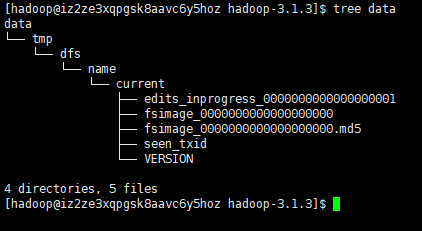

### hadoop 安装
* `tar -zxvf` hadoop包
* 配置环境变量
```
JAVA_HOME=/opt/module/jdk1.8.0_121
HADOOP_HOME=/opt/module/hadoop-3.1.3
PATH=$PATH:$JAVA_HOME/bin:$HADOOP_HOME/bin:$HADOOP_HOME/sbin
export JAVA_HOME HADOOP_HOME PATH
```
* `/etc/core-site.xml` hdfs的分布式系统使用配置 依赖 namenode datanode的进程  
```xml
<property>
  <name>fs.defaultFS</name>
  <value>hdfs://governance1:9000</value>
</property>
```

* hadoop 的数据存放文件路径
```xml
    <property>
      <name>hadoop.tmp.dir</name>
      <!--<value>/tmp/hadoop-${user.name}</value> -->
      <value>/opt/module/hadoop-3.1.3/data/tmp</value>
    </property>
```  

* `hadoop namenode -format`格式化生成路径 

* `hadoop-daemon.sh start namenode` web 访问 `ip:50070` 可以验证namenode是否启动成功

* yarn配置 `yarn-site.xml`
```xml
<property>
    <description>The hostname of the RM.</description>
    <name>yarn.resourcemanager.hostname</name>
    <value>0.0.0.0</value>
  </property> 
```

* mapreduce 程序在yarn上运行需要配置 `mapred-site.xml`
```xml
<property>
  <name>mapreduce.framework.name</name>
  <value>yarn</value>
</property>
```
* 