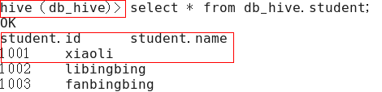

* Hive 特点
    1. Hive并不是一个关系型数据库
    2. 不是基于OLTP（在线事务处理）设计
    3. Hive 无法做到实时查询，不支持行级别更新、删除
    4. Hive要分析的数据存储在HDFS上，hive为数据创建的表结构（schema）存储在RDMS
    5. Hive基于OLAP（在线分析处理） 侧重点在分析上
    6. 本质：将HQL转化成MapReduce程序
* 缺点：
    1. Hive的HQL表达能力有限
        1. 迭代式算法无法表达
        2. 数据挖掘方面不台擅长
    2. Hive的效率比较低
        1. Hive自动生成的MapReduce作业，通常不够智能化
        2. Hive调试比较困难，粒度较粗
* Hive的安装
    1. 保证有JAVA_HOME、HADOOP_HOME
    2. 配置HIVE_HOME 
* Hive数据存储
    1. 存储在hdfs中
    2. 在hive中存储的数据必须是结构化的数据，而且表在创建的时候可以指定分隔符
    3. Hive中默认的记录和字段分隔符  
    
    | 分隔符 | 描述 |
    | ---- | ----|
    | \n   |对于文本来说，每一行都是一条记录，因此换行符可以分割记录 |
    | ^A(Ctrl + A)| 用于分割字段（列） 在create table语句中可以使用八进制编码 \001 表示 |
    | ^B   | 用于分隔Array 或者Struct中的元素，或用于MAP中键值之间分割 \002表示 |
    | ^C   | MAP中键值分割 \003表示 |
    4. create table student (id int,name string)  ROW FORMAT DELIMITED FIELDS TERMINATED BY '\t'(创建表时指定分隔符)
* hive中的元数据存储在关系型数据库中（默认在derby中 生成的metastore_db 目录中调用hive才会查到创建的表结构）
* 将hive存储在mysql中
    1. 将mysql驱动拷贝到 /hive/lib 目录下
    2. 新建 hive-site.xml 文件
        ```xml
          <configuration>
          	<property>
          	  <name>javax.jdo.option.ConnectionURL</name>
          	  <value>jdbc:mysql://hadoop102:3306/metastore?createDatabaseIfNotExist=true</value>
          	  <description>JDBC connect string for a JDBC metastore</description>
          	</property>
          
          	<property>
          	  <name>javax.jdo.option.ConnectionDriverName</name>
          	  <value>com.mysql.jdbc.Driver</value>
          	  <description>Driver class name for a JDBC metastore</description>
          	</property>
          
          	<property>
          	  <name>javax.jdo.option.ConnectionUserName</name>
          	  <value>root</value>
          	  <description>username to use against metastore database</description>
          	</property>
          
          	<property>
          	  <name>javax.jdo.option.ConnectionPassword</name>
          	  <value>123456</value>
          	  <description>password to use against metastore database</description>
          	</property>
          </configuration>
        ```
    3. jdbc链接Hive 需开启 hiveserver2 可以使用beeline 或者java jdbc连接
* 修改default数据仓库原始位置
    ```xml
    <property>
    <name>hive.metastore.warehouse.dir</name>
    <value>/user/hive/warehouse</value>
    <description>location of default database for the warehouse</description>
    </property>
    ```
* 查询显示当前db信息
    ```xml
    <property>
    	<name>hive.cli.print.header</name>
    	<value>true</value>
    </property>
    
    <property>
    	<name>hive.cli.print.current.db</name>
    	<value>true</value>
    </property>
    ```
    
* 修改Hive日志输出位置  
    在 `hive-log4j.properties` 中修改
* Hive 参数配置方式
    1. 配置文件方式 （Hive的配置会覆盖Hadoop的配置。配置文件的设定对本机启动的所有Hive进程都有效）
    2. 命令行参数方式  
    `bin/hive -hiveconf mapred.reduce.tasks=10;`
    3. 参数声明方式  
      `set mapred.reduce.tasks=100;`
    4. 上述三种设定方式的优先级依次递增。即配置文件<命令行参数<参数声明。注意某些系统级的参数，例如log4j相关的设定，必须用前两种方式设定，因为那些参数的读取在会话建立以前已经完成了。
* Hive 数据类型
    1. 基本数据类型  
        
        |Hive数据类型 | java数据类型 | 长度 | 例子 |
        | ---        | ---         |  --- | --- |
        | tinyint    | byte        | 1byte | 20 |
        | smalint    | short       | 2byte | 20 |
        | int        | int         | 4byte | 20 |
        | bigint     | long        | 8byte | 20 |
        | boolean    | boolean     | true\false | TRUE|
        | float      | float       | |  |
        | double     | double      | |  |
        | string     | string      |理论上能存储2GB字符 |  |
        | timestamp  | | 时间类型  | |
        | binary     | | 字节数组  | |
    2. 集合数据类型
    
        | 数据类型 | 描述 | 语法 |
        | ---- | ---- | ---- |
        | STRUCT  | 和c语言中的struct类似，都可以通过“点”符号访问元素内容。例如，如果某个列的数据类型是STRUCT{first STRING, last STRING},那么第1个元素可以通过字段.first来引用 | struct()|
        | MAP | MAP是一组键-值对元组集合，使用数组表示法可以访问数据。例如，如果某个列的数据类型是MAP，其中键->值对是’first’->’John’和’last’->’Doe’，那么可以通过字段名[‘last’]获取最后一个元素 | map() |
        | ARRAY | 数组是一组具有相同类型和名称的变量的集合。这些变量称为数组的元素，每个数组元素都有一个编号，编号从零开始。例如，数组值为[‘John’, ‘Doe’]，那么第2个元素可以通过数组名[1]进行引用 | Array() |
        
        Hive有三种复杂数据类型ARRAY、MAP 和 STRUCT。ARRAY和MAP与Java中的Array和Map类似，而STRUCT与C语言中的Struct类似，它封装了一个命名字段集合，复杂数据类型允许任意层次的嵌套     
    3. 案例实操
        1. 假设某表有如下一行，我们用JSON格式来表示其数据结构。在Hive下访问的格式
            ```json
            {
                "name": "songsong",
                "friends": ["bingbing" , "lili"] ,       //列表Array, 
                "children": {                      //键值Map,
                    "xiao song": 18 ,
                    "xiaoxiao song": 19
                },
                "address": {                      //结构Struct,
                    "street": "hui long guan" ,
                    "city": "beijing" 
                }
            }
            ```
        2. 本地测试数据test.txt
            ```
            songsong,bingbing_lili,xiao song:18_xiaoxiao song:19,hui long guan_beijing
            yangyang,caicai_susu,xiao yang:18_xiaoxiao yang:19,chao yang_beijing
            ```
        3. Hive上创建测试表test
            ```sql
            create table test(
            name string,
            friends array<string>,
            children map<string, int>,
            address struct<street:string, city:string>
            )
            row format delimited fields terminated by ','
            collection items terminated by '_'
            map keys terminated by ':'
            lines terminated by '\n';
            ```
            字段解释：  
            字段解释：
            row format delimited fields terminated by ','  -- 列分隔符  
            collection items terminated by '_'  	--MAP STRUCT 和 ARRAY 的分隔符(数据分割符号)  
            map keys terminated by ':'				-- MAP中的key与value的分隔符  
            lines terminated by '\n';					-- 行分隔符  
        4. 导入文本数据到测试表  
            `hive (default)> load data local inpath ‘/opt/module/datas/test.txt’into table test`
        5. 访问三种集合列里的数据，以下分别是ARRAY，MAP，STRUCT的访问方式
            ```
               hive (default)> select friends[1],children['xiao song'],address.city from test
               where name="songsong";
               OK
               _c0     _c1     city
               lili    18      beijing
               Time taken: 0.076 seconds, Fetched: 1 row(s)
            ```
* 分区表、分桶表（分区针对的是数据的存储路径；分桶针对的是数据文件）
* 分桶抽样查询 `hive (default)> select * from stu_buck tablesample(bucket 1 out of 4 on id);`
* Hive 常用函数 hive3.txt
    
